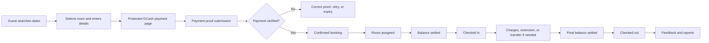

# H+ Hotel Booking and Operations System
## User Training and Company Handover Guide

**Document owner:** H+ Hotel  
**Audience:** Hotel administrators, receptionists, supervisors, and system custodians  
**Training environment:** `https://staging.hhotelbooking.com`  
**Recommended duration:** 3 hours, including exercises  
**Version date:** September 7, 2026

---

## 1. Purpose of the training

This guide gives the company a repeatable session for learning and accepting the H+ Hotel Booking and Operations System. The main demonstration follows one guest from room search through booking, payment review, room assignment, check-in, stay operations, check-out, feedback, reporting, and audit review.

At the end of the session, trainees should be able to:

- Explain how a booking moves through the system.
- Use the correct account for administrator and receptionist work.
- Create and locate online and walk-in reservations.
- Review payments without approving unverified transactions.
- Assign rooms, collect balances, check guests in, record charges, and check guests out.
- Process cancellation, rebooking, room-transfer, and early check-in requests.
- Maintain rooms, promotions, public website content, users, and settings.
- Run and export management reports.
- Find the audit record for an important action.
- Escalate errors without duplicating payments or bookings.

## 2. Training rules

Use the staging website for every exercise. Confirm that the page shows the test-mode or staging indicator before entering data. If the indicator is absent, stop and verify the URL.

Do not use real guest personal data, real payment screenshots, real merchant references, or real money. Use a company-approved training mailbox and fictional names. Payment approval must only be demonstrated when an authorized staging transaction or prepared training record exists. Never tick the merchant-confirmation statement for a transaction that was not checked.

Each trainee must use their own assigned account. Do not share passwords. Administrators should create or activate staff accounts; receptionists should not borrow an administrator account.

Record the booking reference, payment reference, assigned room, and final status in the accompanying facilitator worksheet. These values connect each stage of the demo.

## 3. Roles and responsibilities

| Capability | Guest | Receptionist | Administrator |
|---|---:|---:|---:|
| Search rooms and make an online booking | Yes | Can assist | Can observe |
| Look up a guest booking | Yes, with booking reference and email | Yes | Through relevant operational records |
| Create a walk-in booking | No | Yes | No dedicated walk-in screen |
| Review normal manual GCash proof | No | Yes | Yes |
| Handle an overdue or escalated GCash review | No | No | Yes |
| Reconcile approved manual GCash payments | No | Yes | Yes |
| Resolve a reconciliation exception | No | No | Yes |
| View reservations and assign rooms | No | Yes | Through approval/report areas |
| Check in, collect balance, add charges, check out | No | Yes | Authorized through shared backend controls, but front-desk screens belong to receptionist |
| Submit a room-transfer request | No | Yes | Reviews the request |
| Approve cancellation, transfer, or early check-in | No | No | Yes |
| Review rebooking requests | No | Yes | No dedicated admin rebooking screen |
| Manage users, rooms, promos, website content | No | No | Yes |
| View management reports and audit trail | No | No | Yes |
| Update own profile, password, notifications | No staff account | Yes | Yes |

The administrator owns policy, access, approvals, financial oversight, configuration, and audit review. The receptionist owns day-to-day guest service and the physical stay lifecycle. Approval screens exist to preserve separation of duties.

## 4. Core booking lifecycle

Common booking states are:

- **Pending:** The booking exists but has not completed all confirmation requirements.
- **Confirmed:** Required payment checks are complete.
- **Checked In:** The guest has arrived and the assigned room is occupied.
- **Checked Out:** The stay is complete and active room lines are closed.
- **Cancelled:** The booking was cancelled through the applicable workflow.
- **Rejected:** A pending request or booking was rejected for a recorded reason.
- **No Show:** The guest did not arrive and the required contact attempt was recorded.
- **Expired:** The allowed payment period ended.

Do not treat a submitted GCash screenshot as a completed payment. Payment becomes completed only after its reference, amount, and paid time are matched against the official merchant record.

## 5. Training preparation

Complete these checks one day before the session.

### Environment

- Open `https://staging.hhotelbooking.com` in a private browser window.
- Confirm the staging/test-mode indicator is visible.
- Confirm the staging website and API respond normally.
- Keep production closed during the training.
- Prepare separate browser profiles or private windows for Guest, Receptionist, and Administrator.

### Accounts and communication

- Prepare one active training administrator account.
- Prepare one active training receptionist account.
- Confirm each trainee knows only their assigned temporary password.
- Prepare a training email inbox that can receive booking confirmation messages.
- Test password recovery only with the training mailbox.

### Demo inventory and dates

- Choose a room type with at least one available room.
- Keep a second available room ready for the transfer exercise.
- Select a same-day or approved training date for check-in and the following day for check-out.
- Confirm the selected rooms are not occupied, cleaning, or maintenance.
- Prepare a separate confirmed, fully paid booking if the main online booking cannot be taken through the whole lifecycle during the session.

### Payment exercise

- Choose the company-approved staging payment method.
- If demonstrating manual GCash, prepare an authorized staging transaction record containing the exact reference, exact amount, and exact paid time.
- Prepare one intentionally mismatched proof for the rejection exercise. Do not approve it.
- If no authorized staging merchant record is available, demonstrate submission and review only, then switch to the pre-arranged confirmed booking.

### Cleanup

- Decide who will label, retain, or remove training records after sign-off.
- Record every training booking reference so it can be identified later.
- Do not delete audit records to hide training activity.

## 6. Demo scenario and sample cast

Use this fictional story throughout the main demonstration.

**Guest:** Maria Santos  
**Email:** Company-approved training mailbox  
**Phone displayed beside fixed prefix:** `9171234567`  
**Stored format:** `+639171234567`  
**Party:** 2 adults  
**Stay:** 1 night, or dates approved by the facilitator  
**Room:** An available Deluxe or other prepared room type  
**Special request:** `Quiet room away from the elevator.`  
**Payment:** Authorized staging method  
**Receptionist:** Trainee A  
**Administrator:** Trainee B

The main story is:

> Maria books online for a one-night stay and continues directly to the protected manual GCash payment step. The receptionist reviews the booking and payment, assigns a room, collects any remaining balance, and checks her in. During the stay Maria requests a room transfer. The administrator reviews the request. At departure the receptionist records one training extra charge, settles the balance, checks her out, and the administrator reviews the resulting reports and audit events.

## 7. Recommended agenda

| Time | Topic | Method |
|---:|---|---|
| 0:00–0:10 | Welcome, environment, roles, safety rules | Briefing |
| 0:10–0:25 | Navigation and booking lifecycle | Guided tour |
| 0:25–0:55 | Guest online booking | Live demo |
| 0:55–1:20 | Payment review and reservation preparation | Live demo |
| 1:20–1:30 | Break | — |
| 1:30–2:00 | Check-in, balance, and room assignment | Live demo + practice |
| 2:00–2:25 | Transfer, charges, extension, and check-out | Live demo |
| 2:25–2:45 | Administrator setup, reports, and audit trail | Live demo |
| 2:45–3:00 | Exception exercises, assessment, and sign-off | Hands-on |

## 8. Main live demonstration

### Stage 1 — Introduce the system

1. Show the staging URL and staging/test banner.
2. Explain the three viewpoints: public guest, receptionist, and administrator.
3. Show that role-based menus differ after login.
4. Explain that notifications and badge counts call attention to pending work.
5. State the operating rule: verify the booking state and financial state before changing it.

Expected result: Trainees can identify the environment and describe who owns each part of the process.

### Stage 2 — Guest searches and selects a room

1. Open the public site as the guest.
2. Select the prepared check-in and check-out dates.
3. Set the party to two adults.
4. If a training promo exists, enter it and demonstrate validation. Otherwise leave the code blank.
5. Search for rooms.
6. Explain room type, capacity, nightly/day-use rate, amenities, and availability.
7. Open **Room Details**, then select the prepared room.
8. Review the cart, dates, number of rooms, and price before continuing.

Expected result: The selected room accommodates the party and the price summary matches the selected dates.

Trainer checkpoint: Explain that room availability can change between search and final booking. The server performs a final conflict check.

### Stage 3 — Guest enters details

1. Enter the fictional guest name and training email.
2. In the phone field, point out the fixed `+63` prefix.
3. Enter `09171234567` by paste or typing. Confirm it appears as `9171234567` beside `+63`.
4. Show one invalid example, such as an incomplete number, and explain the validation message.
5. Enter the address, number of guests, and special request.
6. Review the reservation and payment summary.
7. Read the active policies and acknowledgement before accepting them.
8. Submit once and wait for the result. Do not double-click or refresh while creation is in progress.

Expected result: A booking is created with a unique booking reference, and the phone number is stored in the canonical `+639…` format.

Trainer checkpoint: Copy the booking reference into the facilitator worksheet immediately.

### Stage 4 — Protected payment handoff

1. Confirm the booking page continues directly to the manual GCash payment page.
2. Confirm the booking reference and required amount match the reservation summary.
3. Explain that the payment page uses a protected, one-time server handoff.
4. Do not copy or share payment access links between browsers.

Expected result: The guest can access the correct manual GCash payment page immediately after booking creation.

### Stage 5 — Payment submission

1. Confirm the displayed merchant identity and required amount.
2. Use the authorized staging transaction details.
3. Enter the transaction/reference number, amount, sender, and paid time.
4. Upload the prepared training proof.
5. Submit once and record the reference in the worksheet.
6. Explain that **Verifying** means staff review is pending; it does not mean paid or confirmed.

Expected result: The payment is placed in the manual GCash review queue.

### Stage 6 — Receptionist dashboard and reservation search

1. Sign in as the training receptionist.
2. Show the **Dashboard** and explain arrival, departure, occupancy, and pending-work indicators.
3. Open **Reservation**.
4. Search using the booking reference or guest name.
5. Open the reservation details and verify:
   - Guest identity and contact details
   - Dates and guest count
   - Room type and assigned room, if any
   - Booking status
   - Payment status and remaining balance
   - Special requests
6. If the confirmed booking has no room assignment, use **Assign Room** and select an eligible room.

Expected result: Staff can find the booking and identify what must happen before check-in.

### Stage 7 — Manual GCash proof review, when applicable

1. Open **GCash Reviews** and select **Proof Review**.
2. Search for the booking or transaction reference.
3. Open the submission and compare the customer submission with the official staging merchant record.
4. Check all three matching fields:
   - Normalized merchant reference
   - Exact required amount
   - Exact paid date and time
5. Enter the merchant reference and verified amount/time.
6. Tick the merchant-record confirmation only after the record has actually been found.
7. Approve an exact match. If any value differs, use **Reject Proof** and write a clear correction reason.

Expected result after approval: The payment is completed, the booking is confirmed, and automatic room assignment is attempted. If assignment fails, the payment remains approved but staff must manually assign the room.

Receptionist limitation: An overdue/escalated proof requires an administrator. A receptionist cannot override mismatched merchant data.

### Stage 8 — Daily GCash reconciliation

1. In **GCash Reviews**, open **Daily Reconciliation**.
2. Find the approved payment.
3. Compare the system payment with the official staging statement.
4. Choose **Exact Match** only when reference, amount, and paid time match.
5. If they differ, choose **Flag Exception** and describe the discrepancy.
6. Explain that only an administrator resolves an open reconciliation exception.

Expected result: The payment is marked reconciled or appears in the administrator exception queue.

### Stage 9 — Check-in and balance collection

1. Open **Check-In** and search by guest name, booking reference, or email.
2. Select the prepared booking.
3. Confirm the booking is **Confirmed**, email/payment requirements are complete, a valid room is assigned, and the room is ready.
4. Ask the guest for the company-required identification and verify it outside the system according to hotel policy.
5. If a balance remains, select **Record Check-In Balance**.
6. Enter the exact amount and payment method.
7. For cash, count the amount and record an accurate note. For GCash, verify the official merchant record and complete all reference/sender/time fields before confirming.
8. Select **Complete Check-In** and confirm the action.

Expected result: The booking becomes **Checked In** and the assigned room becomes occupied.

If the guest arrives before the allowed time, enter a specific reason and submit **Request Early Check-In**. The administrator must approve before the receptionist retries check-in.

### Stage 10 — Room transfer during the stay

1. Open **Reservation**, locate Maria’s checked-in booking, and open its details.
2. In **Room Transfer**, load available rooms.
3. For a multi-room booking, choose the exact room line to transfer.
4. Select the prepared target room and enter the reason: `Air-conditioning inspection required in current room.`
5. Submit the transfer request.
6. Sign in as administrator and open **Transfer Approvals**.
7. Verify the guest, booking, current room, target room, availability, and reason.
8. Approve the request when all details are valid.
9. Return to the receptionist’s **Transfer Requests** screen and complete the operational handover if the workflow presents a completion step.

Expected result: The active room assignment reflects the approved transfer, with a recorded approval trail.

### Stage 11 — Charges, extensions, and partial room checkout

1. Open **Check-Out** and find the checked-in booking.
2. Show **Extra Charges** and add one training line, such as `Late Check-Out Fee`, with an approved training amount.
3. Save the charge and confirm the remaining balance updates.
4. Demonstrate **Extend Room Stay** without submitting unless an extra training day and room availability were prepared. Explain that the new date must be later and a reason is required.
5. For a multi-room booking, explain that an individual room can be checked out while other active room lines remain.

Expected result: Charges and room-line actions are visible before final checkout.

### Stage 12 — Final balance and check-out

1. Confirm all extra charges are correct.
2. If a balance remains, use **Record Balance Payment**.
3. Enter the exact collected amount, method, and required note. For GCash, perform merchant verification again.
4. Confirm the effective remaining balance is zero.
5. Select **Finalize Check-Out** and confirm.

Expected result: The booking becomes **Checked Out**, active room lines close, and rooms move into the next operational status defined by the system.

Trainer checkpoint: Do not mark a guest checked out while a balance remains or while the wrong room line is selected.

### Stage 13 — Guest booking lookup and feedback

1. On the public site, open **My Booking**.
2. Enter the booking reference and training email.
3. Review the booking’s final status and available actions.
4. If a feedback link exists for the completed training stay, open it and submit a clearly labeled training review.
5. As administrator, open **Feedback Report**, locate the review, inspect issue/recommendation fields, and demonstrate publication/feature controls only with approved training content.

Expected result: The guest can retrieve the booking and the administrator can manage its feedback record.

### Stage 14 — Reports and audit trail

1. Sign in as administrator.
2. Open **Report Management** and demonstrate:
   - **Revenue Report:** collections, refunds, net revenue, and booking activity
   - **Occupancy Report:** room utilization for the chosen dates
   - **Reservation Report:** bookings and statuses
   - **Modified Reservations:** changes and the staff member responsible
   - **Feedback Report:** ratings, issues, recommendations, and publication state
3. Apply a narrow date range that includes the training records.
4. Explain the difference between operational totals and financial totals.
5. Export one PDF and verify that its heading, dates, record count, and values match the screen.
6. Open **Audit Trail**, filter for the training booking or action, and inspect the detail.

Expected result: Management can trace the demo from transaction to report to audit event.

## 9. Administrator module training

### Dashboard

- Review high-level booking and revenue indicators.
- Treat dashboard figures as summaries; use the reports for filtered detail.
- Investigate unusual changes through reservations, payment records, and audit history.

### User Management

- Add a staff account with the correct name, email, role, phone, and active status.
- Edit only verified staff information.
- Deactivate departing or suspended staff promptly.
- Prefer deactivation over deletion when history must remain attributable.
- Never reuse a former employee’s account for a replacement employee.

### Room Management

- Search and filter by room number, type, or status.
- Add/edit the room number, type, capacity, overnight rate, day-use rate, floor, description, amenities, and image.
- Use only supported operational statuses: **Available**, **Occupied**, **Maintenance**, and **Cleaning**.
- Do not set a room to Available until housekeeping/maintenance has cleared it.
- Confirm future reservation impact before deleting a room.

### Promo Codes

- Define a clear code, discount rules, active dates, usage limits, and active status.
- Test the promo on staging before publication.
- Understand the displayed lifecycle: Upcoming, Active, Inactive, or Expired.
- Do not change a live promo without confirming the commercial decision and affected bookings.

### Content Management

The administrator can manage:

- Homepage hero, About Us, highlights, statistics, gallery, nearby places, and testimonials
- Room marketing content and add-ons
- Policies, location details, and brand colors/content

Preview copy and images before saving. Policy wording should be approved by management. Do not publish guest reviews or identifiable guest content without authorization.

### Settings

- **Manual GCash Merchant QR:** Maintain the approved merchant display and QR image.
- **General Settings:** Update the hotel’s operational information and configured booking values.
- **Notification Settings:** Control staff email and new-booking alerts.
- **Security Settings:** Manage maintenance mode and registration controls.
- **Email Delivery Status:** Check service status and use test email only with an approved recipient.

Configuration changes can affect every guest. Record the reason, test on staging, and follow the company change-approval process before production deployment.

### Approval queues

- **Cancellation Approvals:** Review policy, payment/refund state, reason, and evidence; approve or reject; record refund proof and finalize when applicable.
- **Transfer Approvals:** Check the active room line, target room, availability, and operational reason.
- **Early Check-In:** Confirm room readiness and operational capacity before approval.
- **GCash Reviews:** Handle escalated reviews and any authorized override. An override requires a clear reason and must never hide an underpayment.
- **Reconciliation exceptions:** Investigate evidence and close only with a documented resolution.

### Audit Trail

- Search by user, module, action, record, and date where available.
- Open the detail to compare old and new values.
- Use audit data to investigate, not to edit operational records.
- Escalate unexplained account or financial activity immediately.

## 10. Receptionist module training

### Opening the shift

1. Sign in using your own account.
2. Review dashboard arrivals, departures, occupancy, and pending indicators.
3. Check notifications and outstanding GCash reviews.
4. Review today’s check-ins and check-outs.
5. Confirm room readiness with housekeeping operations.
6. Review pending cancellations, transfers, rebookings, and inquiries.

### Reservation

- Search by guest or booking reference before creating a new record.
- Confirm dates, room type, guest count, assigned room, balance, and special requests.
- Assign only rooms returned as eligible by the system.
- Submit a transfer only for a checked-in booking with an active room line.

### Walk-In

1. Choose overnight or day use. Day use cannot exceed 12 hours.
2. Enter accurate guest contact information and stay dates/times.
3. Search available rooms and confirm capacity.
4. Select the room and review the summary.
5. Apply a valid promo if presented by the guest.
6. Record cash or verified GCash payment accurately.
7. For GCash, enter reference, sender, and paid time and personally match the official merchant record before confirming.
8. Submit once and give the booking reference to the guest.

### Payment and GCash Reviews

- **Payment** shows payment records and supports acceptance/rejection where the record is awaiting staff action.
- **GCash Reviews** is the evidence-based manual GCash workflow.
- Never approve based only on a screenshot.
- Reject unclear or mismatched proof with a useful explanation.
- Do not process the same merchant reference for two bookings.

### Check-In

- Require Confirmed status, valid room assignment, ready room, verified completed payment, and zero required pre-check-in balance.
- Record the balance first if prompted.
- Use the early check-in request when arrival is before the configured time.
- Use no-show only after the allowed cutoff and after recording the contact attempt and result.
- Use bulk actions only after verifying every selected guest.

### Check-Out

- Review each active room line.
- Add valid charges with meaningful descriptions and correct amounts.
- Settle the full balance before final checkout.
- Use room-level checkout for multi-room stays when only one room is leaving.
- Record extensions before the original checkout is finalized.
- Verify every item before a bulk checkout.

### Guest Inquiries

- Open new inquiries and read the full message.
- Select **Start handling** to move an inquiry to In Progress.
- Select **Mark resolved** only after the response/action is complete.
- Use **Mark spam** with a reason for irrelevant or abusive messages.
- Administrators alone can restore an inquiry from spam.

### Settings

- Maintain your own profile information.
- Change the temporary password at first sign-in.
- Choose notification preferences appropriate to the shift.
- Report any unknown activity and change the password immediately.

### Closing the shift

1. Finish or hand over pending payment reviews.
2. Confirm all collected payments have references/notes.
3. Reconcile approved manual GCash records against the official statement.
4. Review unresolved arrivals, departures, transfers, and inquiries.
5. Give the next shift a list of booking references requiring action.
6. Log out; do not leave the system open at the front desk.

## 11. Exception training scenarios

Run at least four of these during company training.

### A. Invalid Philippine mobile number

Scenario: The guest enters an incomplete or foreign number.

Expected action: Explain the fixed `+63` prefix and request the ten-digit Philippine mobile portion beginning with `9`. Do not invent digits. Accepted examples normalize to the same value: `9171234567`, `09171234567`, `639171234567`, and `+639171234567`.

### B. Manual GCash mismatch

Scenario: The screenshot says one value but the merchant record has a different reference, amount, or time.

Expected action: Reject the proof with a specific reason. Do not approve, do not use another transaction, and do not tell the guest that payment is complete. If retry is allowed, the guest receives the correction/resubmission route before the deadline.

### C. Payment appears delayed

Scenario: A guest completed the sandbox provider step, but confirmation is delayed.

Expected action: Search by booking reference and review payment status. Wait for reconciliation/status refresh. Do not create a second booking or take a second payment unless an authorized investigation proves the first attempt failed.

### D. Cancellation with payment

Scenario: A paid guest requests cancellation.

Expected action: Locate the request, review policy and financial state, and route it to **Cancellation Approvals**. Record the decision, refund amount/status, proof, and finalization in the proper order. Do not directly reject or cancel a booking with paid amounts outside this workflow.

### E. Rebooking request

Scenario: A guest requests new dates or a room change through the guest booking page.

Expected action: Receptionist opens **Rebooking**, checks availability and request details, then approves or rejects with a useful note. Confirm the final dates/room and communicate the result.

### F. Early arrival

Scenario: A confirmed guest arrives before check-in time.

Expected action: Receptionist verifies room readiness and submits an early check-in request with a reason. Administrator reviews it. Receptionist retries check-in only after approval.

### G. Room problem after check-in

Scenario: The assigned room has an air-conditioning fault.

Expected action: Receptionist chooses an available compatible target room and submits a transfer request. Administrator verifies and approves/rejects. Staff complete the physical key/room handover and confirm the system state.

### H. No-show

Scenario: A confirmed guest has not arrived after the allowed cutoff.

Expected action: Contact the guest using an approved channel. Record the channel, result, and notes in the no-show confirmation. Mark no-show only when the button becomes eligible under system policy.

### I. Room under maintenance

Scenario: Engineering reports a fault in an available room.

Expected action: Administrator checks current/future use, changes the room to Maintenance, and records the operational handover. Return it to Available only after clearance.

### J. Guest inquiry

Scenario: A guest asks about accessibility or a special request using Contact Us.

Expected action: Receptionist opens the inquiry, starts handling it, coordinates the response, and marks it resolved. Preserve the booking reference when related to a reservation.

## 12. Troubleshooting and escalation

| Symptom | First checks | Safe action | Escalate when |
|---|---|---|---|
| Cannot sign in | URL, email spelling, Caps Lock, account status | Try once more or use approved password recovery | Repeated failure, locked/deactivated account, unknown account activity |
| Booking not found | Exact booking reference, exact email, search filters | Search by guest in receptionist Reservation | Reference belongs to a real guest but remains missing |
| Room unavailable | Dates, status, capacity, active room assignment | Choose another eligible room | Inventory appears inconsistent |
| Payment still pending | Booking ref, provider status, GCash queue | Refresh status once and investigate record | Guest was charged but system remains unresolved |
| GCash values differ | Reference normalization, amount, paid minute | Reject or flag exception | Evidence conflicts or transaction may be duplicated |
| Cannot check in | Status, email/payment, balance, room assignment/readiness, time | Complete the missing authorized step | Conditions look complete but action is blocked |
| Cannot check out | Active room line, charges, remaining balance, cancellation lock | Settle/correct the record | Balance or lifecycle calculation appears wrong |
| Email not received | Address, spam, configured mail status | Resend only through the system after waiting | Multiple guests are affected or mail status fails |
| Page/error persists | Capture time, role, URL, booking ref, exact message | Refresh once; avoid repeated submissions | Financial, privacy, or lifecycle action may be affected |

When escalating, provide:

- Environment and URL
- Date/time and staff account name, never the password
- Booking/payment/request reference
- What the user expected and what happened
- Exact on-screen error
- Whether the action was clicked once or retried
- Screenshot with unrelated personal data hidden

Do not edit the database directly, reuse payment references, bypass approval queues, or ask guests to pay again without an authorized investigation.

## 13. Security and privacy operating rules

- Use individual accounts and least-privileged roles.
- Change temporary passwords and keep them out of chat, paper logs, and shared files.
- Verify the environment before entering guest or payment data.
- Collect only information required for the booking.
- Do not copy IDs, payment proofs, or guest data to personal devices.
- Lock the workstation when stepping away and log out at shift end.
- Treat exported reports as confidential company records.
- Do not feature guest feedback without approval.
- Review the audit trail for sensitive configuration, user, refund, override, and financial actions.
- Report suspected account compromise or data exposure immediately.

## 14. Trainee practical assessment

Each trainee must complete the tasks appropriate to their role without coaching on the final attempt.

### Receptionist assessment

- Find a reservation using its reference.
- Explain status, payment, room assignment, balance, and next action.
- Create a staging walk-in booking with a valid room and payment record.
- Correctly handle a GCash mismatch.
- Assign a room and check in an eligible guest.
- Record a charge, settle the balance, and check out.
- Submit a transfer or early check-in request.
- Process an inquiry from New to Resolved.
- Log out securely.

### Administrator assessment

- Create/deactivate a training staff account correctly.
- Place a prepared room into Maintenance and restore it after clearance.
- Review one approval request and explain the evidence used.
- Resolve or explain the path for a payment reconciliation exception.
- Create or inspect a staging promo and explain its validity dates.
- Edit a harmless staging CMS field and verify the public preview.
- Run a date-filtered report and export a matching PDF.
- Find the corresponding audit event.

Passing standard: Every critical financial, approval, access, and lifecycle task must be completed correctly. A trainee who approves unmatched payment evidence, shares credentials, acts in production, or bypasses a required approval must repeat that section.

## 15. Handover acceptance

Before the company signs acceptance, confirm:

- Named system owner and backup owner are assigned.
- Administrator and receptionist accounts are issued and tested.
- Temporary credentials have been changed.
- Staff can complete the main booking lifecycle on staging.
- Payment verification and reconciliation responsibilities are assigned.
- Opening, closing, refund, no-show, and escalation procedures are approved.
- Company policy owners have reviewed public policies and CMS content.
- Management can produce and verify reports.
- Audit records are understood and accessible to authorized administrators.
- Production changes will follow staging test, user review, and explicit approval.
- Support contacts and response expectations are recorded.
- Training artifacts and attendance/sign-off records are stored in the company’s approved location.

---

This guide describes the functions present in the current application. Company policy controls who may approve refunds, merchant records, rates, promotions, guest content, and production changes.
